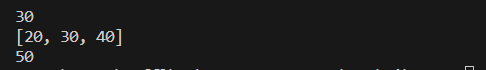

# akses list:
## programnya
````python
# Buat sebuah list sebanyak 5 elemen dengan nilai bebas
my_list = [10, 20, 30, 40, 50]
# Tampilkan elemen ke 3
print(my_list[2])
# Ambil nilai elemen ke 2 sampai elemen ke 4
print(my_list[1:4])
# Ambil elemen terakhir
print(my_list[-1])
````
## Outputnya



## ubah elemen list:
### programnya
````python
# Ubah elemen ke 4 dengan nilai lainnya
my_list[3] = 45
# Ubah elemen ke 4 sampai dengan elemen terakhir
my_list[3:] = [45, 55]
````

## Tambah elemen list:
````python
# Ambil 2 bagian dari list pertama (A) dan jadikan list ke 2 (B)
A = my_list[:2]
B = A.copy()
# Tambah list B dengan nilai string
B.append("sixty")
# Tambah list B dengan 3 nilai
B.extend([70, 80, 90])
````
## Gabungkan list B dengan list A
````python
combined_list = A + B
print(combined_list)
````
### Outputnya
