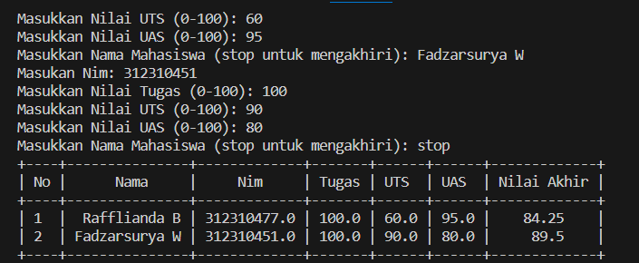

# Praktikum 5
## programnya
````python
from prettytable import PrettyTable

def calculate_nilai_akhir(tugas, uts, uas):
    return 0.3 * tugas + 0.35 * uts + 0.35 * uas

# Membuat objek PrettyTable
table = PrettyTable()
table.field_names = ["No", "Nama", "Nim", "Tugas", "UTS", "UAS", "Nilai Akhir"]

# Buat list kosong untuk menyimpan data mahasiswa
data_mahasiswa = []

while True:
    # Meminta input data mahasiswa
    nama = input("Masukkan Nama Mahasiswa (stop untuk mengakhiri): ")
    
    # Check apakah pengguna ingin mengakhiri input
    if nama.lower() == 'stop':
        break
    nim = float(input("Masukan Nim: "))
    tugas = float(input("Masukkan Nilai Tugas (0-100): "))
    uts = float(input("Masukkan Nilai UTS (0-100): "))
    uas = float(input("Masukkan Nilai UAS (0-100): "))

    # Menghitung nilai akhir
    nilai_akhir = calculate_nilai_akhir(tugas, uts, uas)

    # Menambahkan data ke dalam list
    data_mahasiswa.append({
        'No': len(data_mahasiswa) + 1,
        'Nama': nama,
        'Nim': nim,
        'Tugas': tugas,
        'UTS': uts,
        'UAS': uas,
        'Nilai Akhir': nilai_akhir
    })

# Mengisi tabel dengan data
for data in data_mahasiswa:
    table.add_row([data['No'], data['Nama'], data['Nim'], data['Tugas'], data['UTS'], data['UAS'], data['Nilai Akhir']])

# Menampilkan tabel
print(table)
````

## Outputnya


# Flowchart
